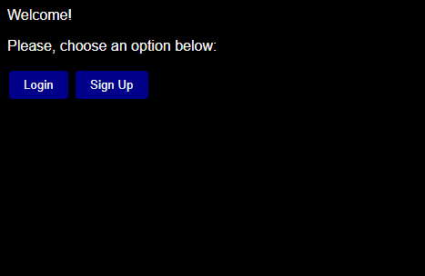
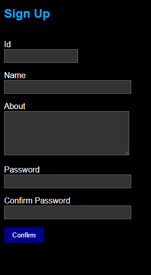
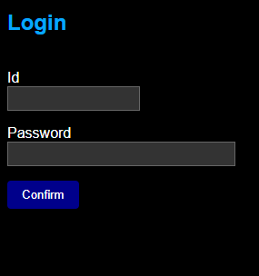
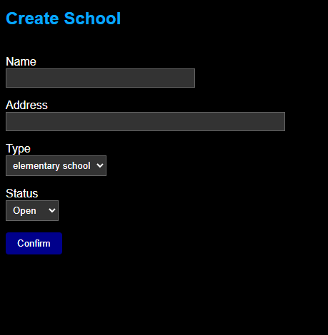
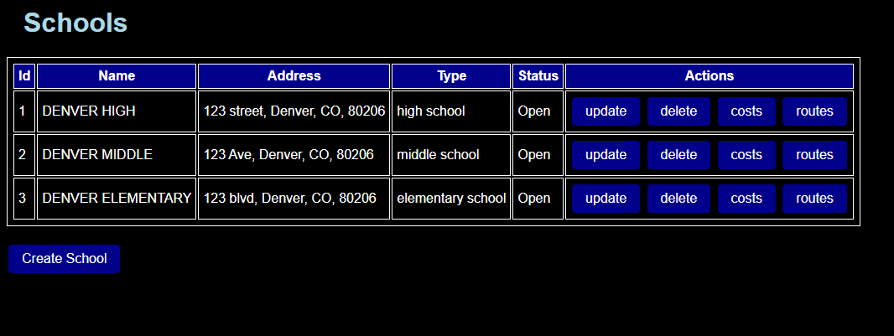
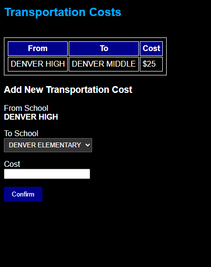
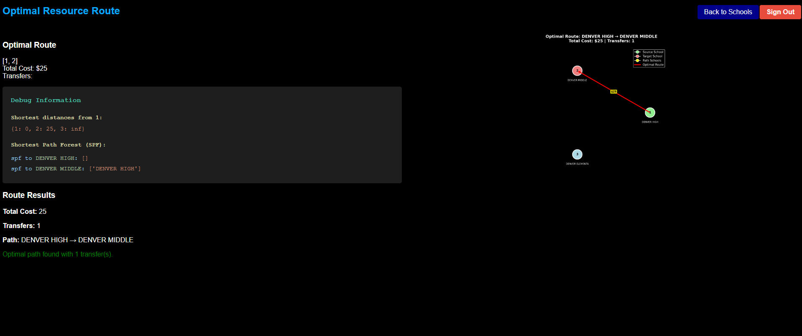

# Campus-Link

# Purpose/Overview
The app’s purpose is to help users manage school facilities and optimize transportation routes between them. It allows users to view schools, enter transportation costs, and find the most cost-effective path between schools, including visualizing routes and transfers using a graph.

The project involves developing a web application to manage information about schools within the district. This includes details such as school name, location, type (elementary, middle, or high school), and operational status (open or closed).

Additionally, the application will track the cost of transfering shared resources (e.g., laptops, lab equipment, books) between schools. By minimizing transfer costs, the application will help the district reduce overall expenditures and improve operational efficiency.

## Project Structure
```
.venv
instance
|__ schools.db
pics
src
|__app
|____ __init__.py
|____ models.py
|____ routes.py
|____ forms.py
|____ heapq.py
|____ init_db.py
|____ optimizer.py
|____ sp.py
static
|__ style.css
templates
|__schools
|________ create.html
|________ update.html
|__ base.html
|__ index.html
|__ costs.html
|__ signup.html
|__ login.html
|__ schools.html
|__ optimizer.html
uml
|__ class.wsd
|__ use_case.wsd
.gitignore
Dockerfile
README.md
requirements.txt
```

# Implementation Phase
Includes UML diagrams, coding implementation/features, security features, and dependencies.

## Requirement Analyisis
Use Case UML diagram

1. Users must be able to authenticate themselves.
2. Users should be able to list all schools.
3. Users should be able to create, update, and delete school records.
4. Users should be able to update the availability and transfer status of shared resources (planned).
5. Users should be able to retrieve optimal resource distribution plans between schools.

## Features Overview
Core capabilities provided by the system:

- User authentication (signup, login, logout) with hashed passwords (bcrypt)
- CRUD Management of School records (name, address, type, status)
- Management of directional transportation costs between schools
- Dijkstra-based optimal route / cost calculation between any two schools
- Visual graph rendering (matplotlib) of the optimal route with costs and transfers
- Debug information (shortest path forest + distance table) for learning/verification

## Forms & Validation
Forms (defined in `forms.py`) enforce input consistency. Typical validations include:

- Required fields (school name, type, status, cost)
- Password confirmation during signup
- Preventing cost entries where source == destination

## Algorithm: Dijkstra’s Shortest Path
Implementation split:

- `sp.dijkstra(graph, source, target)` returns either a single path or all distances/paths.
- `ResourceOptimizer` builds an adjacency graph from the database each request.
- Complexity: O(E log V) using a binary heap (`heapq`).

Returned route metadata (`optimizer.find_optimal_path`):

```json
{
  "success": true,
  "path": [1, 3, 5],
  "path_names": ["Central HS", "STEM MS", "North Elem"],
  "total_cost": 42,
  "num_transfers": 2,
  "debug": { "distances": {"1":0, "3":10, ...}, "spf": {...} }
}
```

## Graph Visualization
Endpoint: `/schools/<id>/routes/visual?target_id=<other_id>`

- Layout: circular placement of all schools.
- Colors: green (source), red (target), yellow (path nodes), blue (others).
- Edge arrows indicate direction with red highlighting optimal route.
- Cost labels placed mid-edge.
- Uses `matplotlib` with Agg backend for headless Docker rendering.

If matplotlib is missing (local minimal setup), endpoint returns a clear 500 message.

## Security Considerations
- bcrypt used for password hashing (salted). Avoid storing plaintext.
- Session secret should not be committed (configure via `SECRET_KEY`).
- Validate all user inputs (currently handled via WTForms).

## Technology Stack
- Python 3.12
- Flask (web framework)
- Flask-Login (session/auth management)
- Flask-WTF / WTForms (form handling & validation)
- SQLAlchemy (ORM + SQLite backend)
- bcrypt (password hashing)
- matplotlib & numpy (graph visualization)
- gunicorn (production WSGI server in Docker)

# Deployment Phase
Instructions to run docker image, setup/initialize database file included.

## Docker Workflow
```bash
### Build image
docker build -t schools-app .

### Run container (removes on stop)
docker run --rm --name schools -p 8000:8000 schools-app

### Rebuild without cache (if needed)
docker build --no-cache -t schools-app .

Access at: http://localhost:8000

### If you see a name conflict error ("container name is already in use"), remove the previous container:
docker rm -f schools
```

## Database Initialization
No manual migration step is required for this project stage. On startup:

1. Flask creates the `instance` folder (Dockerfile also ensures it exists).
2. On import, `db.create_all()` (in `app/__init__.py`) creates tables: `users`, `schools`, `transportation_costs`.
3. The file `instance/schools.db` appears on first write.

To inspect the database locally:

```bash
sqlite3 instance/schools.db
.tables
SELECT * FROM schools;
```

## Environment & Configuration
Current configuration values (see `app/__init__.py` & `dockerfile`):

- SECRET KEY: hardcoded in development (`app.secret_key = 'you will never know'`) – would be replaced with an environment variable for production.
- Database URI: `sqlite:///{instance_path}/schools.db` (Flask instance folder) auto-created on first run.
- Gunicorn runtime variables (overridable at `docker run`):
  - `PORT` (default 8000)
  - `WORKERS` (default 2)
  - `THREADS` (default 2)
  - `TIMEOUT` (default 60)

## Typical User Workflow
1. Sign up → log in.
2. Create several schools.
3. Enter transportation costs for each school to others.
4. Navigate to a school → “Routes” → select a target school → compute.
5. View optimal path and the visualization PNG.

See Pics for Usage below:








## Example Route Output (Textual)
```
Optimal path found with 2 transfer(s).
Path: Central HS -> STEM MS -> North Elem
Total Cost: $42
Transfers: 2
```

# Known Limitations
- No email verification or password reset.
- SQLite backend limits concurrent writes, not ideal for scaling application.
- Hardcoded flask secret key.
- Costs must be added manually, no import data function implemented.
- Graph visualization can become cluttered with many schools.
- No accessibility settings/features.

# Future Improvements
- Replace hardcoded secret key with environment variable.
- Add password strength validation + rate limiting.
- Implement resource allocation optimization beyond simple path cost.
- Introduce pagination and search for schools.
- Add automated test suite and CI workflow.
- Add API endpoints (JSON) for integration.